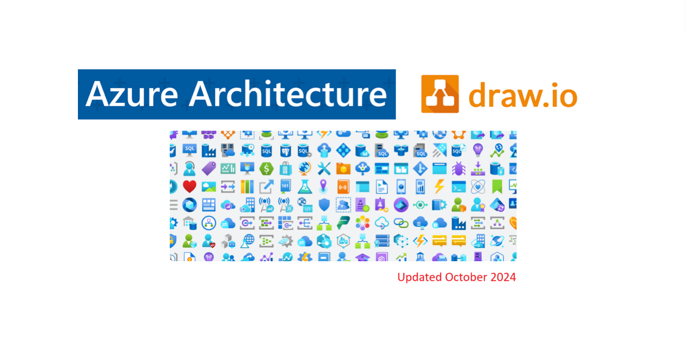
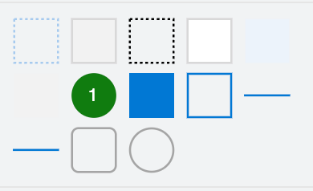
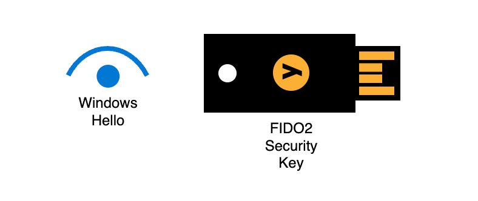
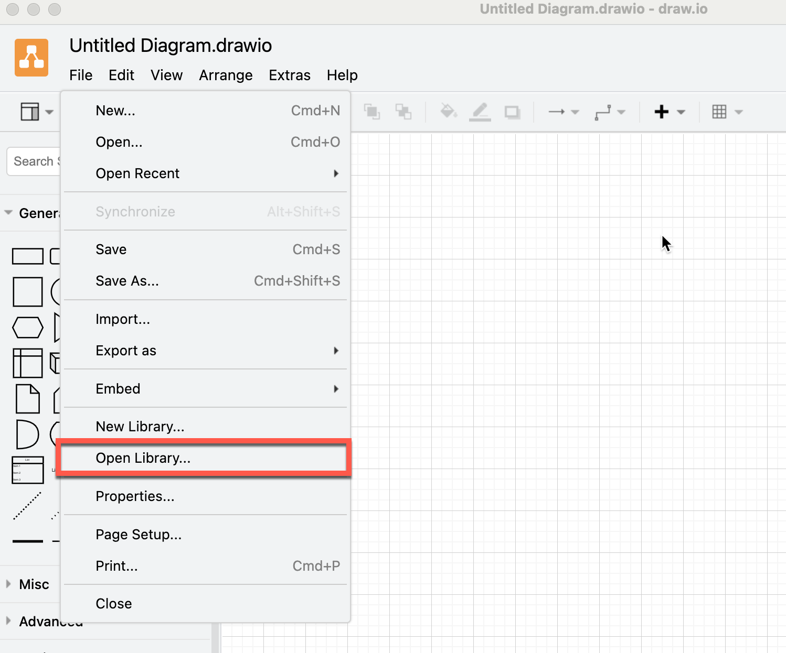
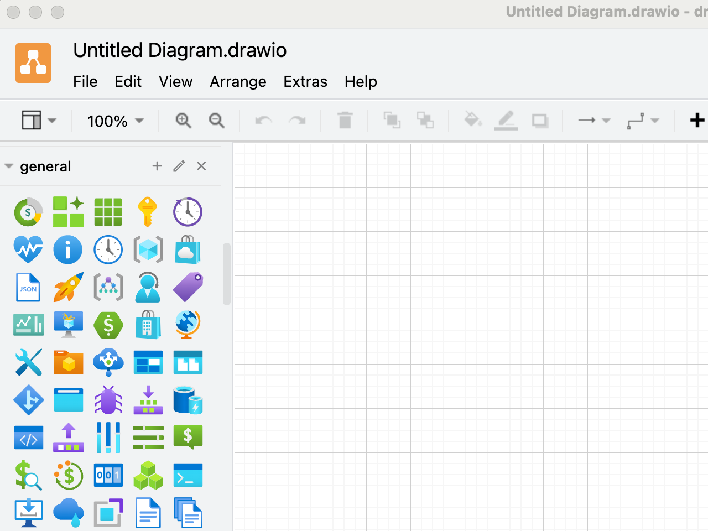

# Azure Architecture Icons for draw.io

Architecture diagrams play a crucial role in conveying design choices and illustrating the connections among different components within a specific workload. This repository hosts a collection of Azure architecture icons, featuring Azure product symbols, to assist you in crafting a bespoke architecture diagram using draw.io.

## Open in draw.io online

- [all azure public service icons](https://app.diagrams.net/?splash=0&clibs=Uhttps%3A%2F%2Fraw.githubusercontent.com%2Fdwarfered%2Fazure-architecture-icons-for-drawio%2Fmain%2Fall-azure-public-service-icons.xml)

- [microsoft 365 architecture icons](https://app.diagrams.net/?splash=0&clibs=Uhttps%3A%2F%2Fraw.githubusercontent.com%2Fdwarfered%2Fazure-architecture-icons-for-drawio%2Fmain%2F2024-microsoft-365-content-icons%2F2024-microsoft-365-content-icons.xml)

## Project Developed Icons

### Azure Architecture Styling

### MFA Methods

### Terms

`.components\`

No license restrictions.

## Microsoft Architecture Icons

[https://learn.microsoft.com/en-us/azure/architecture/icons/](https://learn.microsoft.com/en-us/azure/architecture/icons/)

- Azure Architecture Icons
- Microsoft 365 Architecture Icons

### Terms
Microsoft permits the use of these icons in architectural diagrams, training materials, or documentation.
You may copy, distribute, and display the icons only for the permitted use unless granted explicit
permission by Microsoft. Microsoft reserves all other rights.

####  Do's
- Use the icons to illustrate how products can work together
- In diagrams, we recommend to include the product name somewhere close to the icon
- Use the icons as they would appear within Azure

#### Don'ts
- Don’t crop, flip or rotate icons
- Don’t distort or change icon shape in any way
- Don’t use Microsoft product icons to represent your product or service

## Alternatively, you can download and save the files locally, then utilise the Open Library feature within draw.io

[Azure Architecture Icons for Draw.io v1.0 February 2024](https://github.com/dwarfered/azure-architecture-icons-for-drawio/releases/tag/v1.0)

